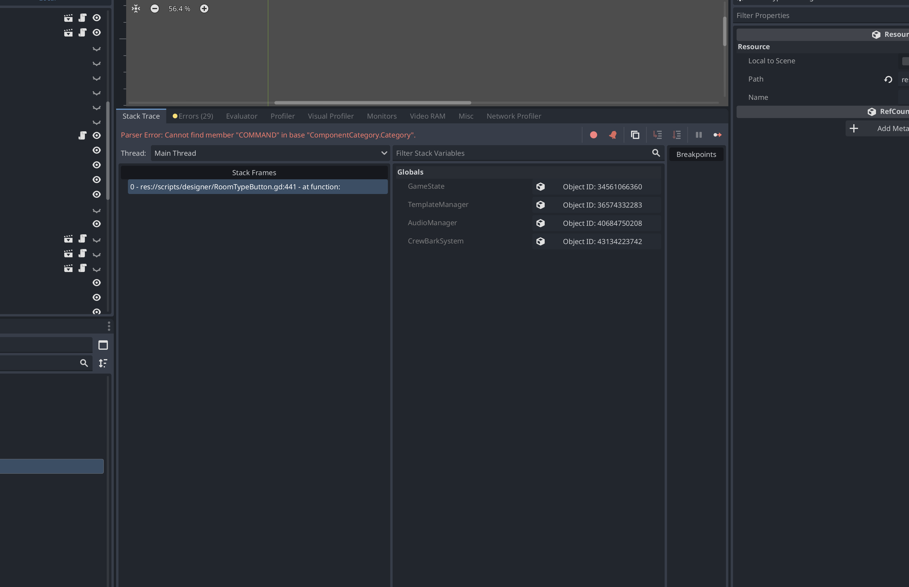

# Component Metadata & Rich Descriptions

**Status:** 🔴 Planned
**Priority:** ➡️ Medium (Enhances usability, not blocking)
**Estimated Time:** 3-4 hours (writing + implementation)
**Dependencies:** Seven-Category Structure, Component Tags System
**Assigned To:** Content Design + Development Team

---

## Purpose

**Why does this feature exist?**
Current components have minimal information (name, cost, size). Players need contextual guidance to make informed strategic decisions: What does this component do? Where should I place it? How does it synergize with others?

**What does it enable?**
- Strategic component selection based on clear descriptions
- Placement guidance (edge vs core, synergy hints)
- Learning without external wiki/documentation
- Flavor text that reinforces the game's engineering fantasy
- Future-proof structure for component unlocks, tech tiers, and lore

**Success criteria:**
- Every component has 3 levels of description: short (1 sentence), long (2-3 sentences), tactical (placement/usage tips)
- Players can make informed decisions without leaving ship designer
- Descriptions focus on **why** to use component, not just **what** it does
- Writing style consistent (military-technical tone, concise, informative)

---

## How It Works

### Overview

Component metadata enriches each component with layered information:

1. **Short Description** (1 sentence): Appears in component button, visible while browsing. Example: "Generates 100 power for adjacent systems"

2. **Long Description** (2-3 sentences): Appears in detailed tooltip (on hover), explains component role and tradeoffs. Example: "The Main Reactor is your ship's primary power source. It generates 100 power and distributes it to up to 8 adjacent components. Most ships need 2-3 reactors for optimal performance."

3. **Tactical Note** (1-2 sentences): Practical placement/usage advice for strategy. Example: "Protect reactors in your ship's interior. Destroying a reactor disables all adjacent systems instantly. Consider redundant reactors for resilience."

This three-tier structure lets players absorb information progressively: Quick glance (short) → Deeper consideration (long) → Strategic planning (tactical).

### The Three Description Tiers

**Short Description:**
- **Length**: 3-10 words maximum
- **Purpose**: Quick identification—what does this component do in one glance?
- **Location**: Component button in palette, stats panel
- **Examples**:
  - Reactor: "Generates 100 power for adjacent systems"
  - Weapon: "Deals 10 damage per turn"
  - Shield: "Absorbs 15 damage per turn"
  - Bridge: "Command center (Required, Unique)"

**Long Description:**
- **Length**: 2-3 sentences (40-60 words)
- **Purpose**: Full explanation of component role, mechanics, and trade-offs
- **Location**: Detailed tooltip (hover), component info panel
- **Examples**:
  - Reactor: "The Main Reactor is your ship's primary power source. It generates 100 power and distributes it to up to 8 adjacent components. Most ships need 2-3 reactors for optimal performance."
  - Weapon: "Standard energy weapon. Deals consistent 10 damage per turn with moderate power consumption. Stack multiple weapons for high damage output."
  - Bridge: "The Bridge is your ship's command center. Every ship must have exactly one Bridge to function. If destroyed, your ship is lost regardless of remaining HP."

**Tactical Note:**
- **Length**: 1-2 sentences (20-40 words)
- **Purpose**: Strategic guidance—where to place, how to use, synergy hints
- **Location**: Detailed tooltip, strategy guide
- **Examples**:
  - Reactor: "Protect reactors in your ship's interior. Destroying a reactor disables all adjacent systems instantly. Consider redundant reactors for resilience."
  - Weapon: "Place weapons in forward sections (rightmost 2 columns) to face the enemy. Cluster weapons adjacent to each other for Fire Rate synergy (+20% damage per pair)."
  - Shield: "Shields are your first line of defense. Place shields adjacent to reactors for Shield Capacity synergy (+30% absorption). Spread shields across your ship for even protection."

### User Flow

```
1. Player browses Power Systems category
2. Player sees Reactor button: "Generates 100 power for adjacent systems" (short description)
3. Player hovers over Reactor
4. System displays detailed tooltip with long description + tactical note
5. Player reads: "Main Reactor is primary power source... 100 power to 8 adjacent... Most ships need 2-3"
6. Player reads tactical note: "Protect reactors in interior... Destroying reactor disables adjacent systems... Consider redundancy"
7. Player understands: Reactor is critical, needs protection, place centrally
8. Result: Informed strategic decision
```

### Rules & Constraints

- **Mandatory fields**: Every component must have short description (minimum). Long and tactical are recommended but not required for simple components (Armor).
- **Tone**: Military-technical, concise, informative. Avoid humor, memes, or casual language.
- **Focus**: Describe **gameplay effects**, not lore. Example: "Generates 100 power" not "Advanced fusion core designed by Starfleet R&D in 2347"
- **Avoid spoilers**: Don't reveal advanced strategies or exploits in descriptions. Let players discover.
- **Consistency**: Use same phrasing patterns. Example: Weapons always say "Deals X damage per turn", not "Does X dmg" or "X damage/turn"

### Edge Cases

- What if a component has no strategic depth?
  → Armor example: Short = "+20 HP", Long = "Passive armor plating adds +20 HP", Tactical = "Cheap HP boost, use as budget filler"

- What if tactical note reveals exploit?
  → Avoid. Example: Don't say "Stack 20 armor for invincibility". Say "Armor is cost-efficient defense"

- What if component mechanics change?
  → Update descriptions. Metadata is content, not code—easy to revise.

---

## User Interaction

### Controls

- **Hover over component button**: Tooltip shows long description + tactical note
- **Click info icon** (future): Opens dedicated component info panel with full details
- **Search** (future): Searches component names + descriptions

### Visual Feedback

- **Short description**: Always visible in component button (small text below name)
- **Long description**: Appears in tooltip after 0.5s hover
- **Tactical note**: Appears in tooltip, highlighted in cyan for emphasis
- **Icons**: 💡 icon before tactical note to distinguish it from description

### Audio Feedback

- **Hover for tooltip**: Soft "whoosh" (info appearing)
- No audio for reading descriptions

---

## Visual Design

### Layout

**Component Button with Short Description:**
```
┌──────────────┐
│   Reactor    │
│     [4]      │
│     3×2      │
│ Generates    │
│ 100 power    │
└──────────────┘
```

**Detailed Tooltip with Long + Tactical:**
```
┌────────────────────────────────────────────────┐
│ ⚡ REACTOR                                      │
│ Category: Power Systems                        │
│ Cost: 4 | Size: 3×2 | HP: 100                  │
├────────────────────────────────────────────────┤
│ The Main Reactor is your ship's primary power  │
│ source. It generates 100 power and distributes │
│ it to up to 8 adjacent components. Most ships  │
│ need 2-3 reactors for optimal performance.     │
├────────────────────────────────────────────────┤
│ Generates: 100 power                           │
│ Powers: 8 adjacent tiles (cardinal + diagonal) │
├────────────────────────────────────────────────┤
│ 🏷️ Tags: Generates Power, Vulnerable Core,    │
│          Power Synergy                         │
├────────────────────────────────────────────────┤
│ 💡 Tactical Note:                              │
│ Protect reactors in your ship's interior.      │
│ Destroying a reactor disables all adjacent     │
│ systems instantly. Consider redundant reactors │
│ for resilience.                                │
└────────────────────────────────────────────────┘
```

### Components

- **Short Description Label**: 10pt font, gray text, 2 lines max, wraps
- **Long Description Panel**: Tooltip body, white text, 12pt, readable line height
- **Tactical Note Section**: Cyan highlighted box, 💡 icon prefix, italic text
- **Separator Lines**: Thin lines between description sections

### Visual Style

- **Colors**:
  - Short description: #B0B0B0 (gray, readable but not prominent)
  - Long description: #FFFFFF (white, primary reading text)
  - Tactical note: #4AE2E2 (cyan, strategic emphasis)

- **Fonts**:
  - Short: 10pt regular
  - Long: 12pt regular, 1.4 line height
  - Tactical: 11pt italic

- **Formatting**:
  - Short description: Sentence case, no period
  - Long description: Full sentences with periods
  - Tactical note: Full sentences, bullet points if multiple tips

### States

- **Short description**: Always visible in button
- **Long description**: Appears on 0.5s hover
- **Tactical note**: Appears with long description (same tooltip)

---

## Technical Implementation

### Scene Structure

(No new scenes—metadata stored in data structure, displayed in existing tooltips)

### Script Responsibilities

- **ComponentMetadata.gd**: New class storing all metadata (short_desc, long_desc, tactical_note, flavor_text, unlock_requirements, etc.)
- **RoomData.gd**: Extended with `get_metadata(room_type)` returning ComponentMetadata
- **ComponentButton.gd**: Displays short description in button layout
- **TooltipManager.gd**: Generates detailed tooltip with long + tactical descriptions

### Data Structures

```gdscript
class_name ComponentMetadata

var short_description: String      # "Generates 100 power for adjacent systems"
var long_description: String       # "The Main Reactor is your ship's..."
var tactical_note: String          # "Protect reactors in your ship's interior..."
var flavor_text: String            # (Optional) "Designed by Starfleet Engineering..."
var unlock_requirements: Array     # (Future) ["mission_2_complete"]
var tech_tier: int                 # (Future) 1=basic, 2=advanced, 3=prototype
```

### Integration Points

- Connects to: RoomData (component definitions), ComponentButton (short desc display), Tooltip system (long/tactical display)
- Emits signals: None (passive data)
- Listens for: None
- Modifies: Component button layout, tooltip content

### Configuration

- Metadata storage: `scripts/data/ComponentMetadata.gd` (class) + lookup function in RoomData.gd
- Description text: Written directly in ComponentMetadata.create_for_room_type() factory method
- Formatting constants: Tooltip layout, colors, fonts in TooltipManager.gd

---

## Acceptance Criteria

Feature is complete when:

- [ ] ComponentMetadata class created with 3 description fields (short, long, tactical)
- [ ] All 9 existing components have short descriptions written
- [ ] All 9 existing components have long descriptions written
- [ ] All 9 existing components have tactical notes written
- [ ] Short descriptions display in component buttons (palette)
- [ ] Long descriptions + tactical notes display in tooltips (hover)
- [ ] Writing style consistent across all components (military-technical tone)
- [ ] Descriptions focus on gameplay strategy, not just stats
- [ ] Tactical notes provide actionable placement/usage advice

---

## Testing Checklist

### Functional Tests

- [ ] Reactor short description: "Generates 100 power for adjacent systems"
- [ ] Reactor long description: Mentions primary power source, 8 adjacent tiles, 2-3 needed
- [ ] Reactor tactical note: Mentions interior placement, destruction risk, redundancy
- [ ] Weapon tactical note: Mentions forward placement, Fire Rate synergy
- [ ] Shield tactical note: Mentions Shield Capacity synergy, spread placement
- [ ] Bridge descriptions emphasize required + unique + critical
- [ ] Armor descriptions emphasize cheap HP boost + filler
- [ ] All descriptions fit in tooltip without overflow scrolling

### Edge Case Tests

- [ ] Component with minimal complexity (Armor): Short description sufficient, long brief
- [ ] Component with high complexity (Reactor): All 3 tiers provide value
- [ ] Very long tactical note: Wraps correctly, doesn't break tooltip layout

### Integration Tests

- [ ] Short description appears in palette button
- [ ] Hover component button: Tooltip shows long + tactical after 0.5s
- [ ] Move mouse away: Tooltip disappears
- [ ] Descriptions don't interfere with component selection (clicking button still selects)

### Polish Tests

- [ ] Descriptions readable (font size, contrast, line height)
- [ ] Tactical note visually distinct (cyan highlight, 💡 icon)
- [ ] No typos or grammatical errors
- [ ] Consistent terminology (always "power", not "energy"; always "HP", not "health")
- [ ] Descriptions fit within tooltip without excessive scrolling

---

## Known Limitations

- **Manual writing**: Each component requires hand-written descriptions (no generation). This is intentional—quality over quantity.
- **No dynamic descriptions**: Descriptions are static text, don't update based on player progress or ship state. Future: Context-aware descriptions ("You have 2 reactors → Consider a 3rd for redundancy")
- **English only**: MVP doesn't support localization. Future: Separate description files per language.

---

## Future Enhancements

*(Not for MVP, but worth noting)*

- **Flavor text**: Optional lore text for immersion ("Designed by Starfleet Engineering Corps, the Mark IV Reactor has powered the fleet since 2347")
- **Context-aware descriptions**: Show different tactical notes based on player's current ship ("You have no reactors → Add a reactor to power your weapons")
- **Video/GIF examples**: Animated demonstrations of component placement in tooltip
- **Community descriptions**: Player-submitted tactical notes (voted on, curated)
- **Comparison mode**: Hover two components simultaneously, see side-by-side comparison

---

## Implementation Notes

*(For AI assistant or future you)*

- **Why 3 tiers?**: Progressive disclosure. Short for scanning, long for understanding, tactical for mastery. More tiers = too complex.
- **Why separate tactical note?**: Strategy advice is different from mechanics explanation. Separating lets players find what they need.
- **Writing tip**: Start with short description (clearest), expand to long (add context), finish with tactical (actionable advice). This flow ensures consistency.
- **Alternative considered**: Single long description (no tiers). Rejected because component buttons can't fit long text—need concise short version.
- **Gotcha**: Don't let descriptions become mini-essays. If you need >60 words, component is too complex or description is too detailed. Simplify.

---

## Content Checklist: Component Descriptions

### Bridge
- **Short**: "Command center (Required, Unique)"
- **Long**: "The Bridge is your ship's command center. Every ship must have exactly one Bridge to function. If destroyed, your ship is lost regardless of remaining HP."
- **Tactical**: "Place the Bridge deep in your ship's interior, surrounded by armor or shields. Protect it at all costs—losing the Bridge means instant defeat."

### Reactor
- **Short**: "Generates 100 power for adjacent systems"
- **Long**: "The Main Reactor is your ship's primary power source. It generates 100 power and distributes it to up to 8 adjacent components. Most ships need 2-3 reactors for optimal performance."
- **Tactical**: "Protect reactors in your ship's interior. Destroying a reactor disables all adjacent systems instantly. Consider redundant reactors for resilience."

### Weapon
- **Short**: "Deals 10 damage per turn"
- **Long**: "Standard energy weapon. Deals consistent 10 damage per turn with moderate power consumption. Stack multiple weapons for high damage output."
- **Tactical**: "Place weapons in forward sections (rightmost 2 columns) to face the enemy. Cluster weapons adjacent to each other for Fire Rate synergy (+20% damage per pair)."

### Shield
- **Short**: "Absorbs 15 damage per turn"
- **Long**: "Energy shield generator. Absorbs up to 15 damage per turn before hull takes damage. Shields regenerate between battles."
- **Tactical**: "Shields are your first line of defense. Place shields adjacent to reactors for Shield Capacity synergy (+30% absorption). Spread shields across your ship for even protection."

### Engine
- **Short**: "Adds +1 initiative (shoot first)"
- **Long**: "Propulsion system that controls turn order. Each engine adds +1 initiative. Higher initiative means shooting first in combat, critical for offensive strategies."
- **Tactical**: "Place engines in rear sections (leftmost 2 columns). Cluster engines together for Initiative synergy (+2 initiative per pair). 3+ engines recommended for aggressive builds."

### Armor
- **Short**: "+20 HP to hull"
- **Long**: "Passive armor plating. Each armor module adds +20 HP to your ship's total. Cheap and effective HP boost. No power required."
- **Tactical**: "Armor is the most cost-efficient defense (1 cost for 20 HP). Use armor as filler for unused budget. Place armor adjacent to weapons for Durability synergy (weapons take 2 hits to destroy)."

### Conduit
- **Short**: "Extends power connections"
- **Long**: "Small power distribution node. Extends power from reactors by 1 tile in all directions. Cheap way to power distant systems."
- **Tactical**: "Use conduits to connect distant components to your power grid. Vulnerable: destroying a conduit breaks the power chain. Consider relays for critical connections."

### Relay
- **Short**: "Power hub, distributes to 8 adjacent tiles"
- **Long**: "Power distribution hub. Acts as a mini-reactor, powering 8 adjacent tiles. More resilient than conduit chains. Essential for large ships."
- **Tactical**: "Relays are stronger than conduits but cost more. Place relays at strategic junctions to power multiple systems. Destroying a relay disrupts an entire power zone."

---

## Change Log

| Date | Change | Reason |
|------|--------|--------|
| Dec 4, 2024 | Initial spec | Component metadata needed for informed player decisions |
| Dec 4, 2024 | Added content checklist | All 9 components need descriptions written |
